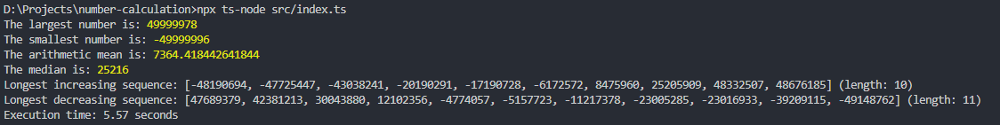

# Number Calculation Application

The application calculates the largest number, smallest number, arithmetic mean, median, and measures the execution time in seconds.

## Prerequisites

Before running this application, ensure you have the following installed:

- Node.js: [Download Node.js](https://nodejs.org/) and follow the installation instructions for your operating system.

## Installation

1. Clone the repository:
   ```bash
   git clone https://github.com/Ann-Maksay/number-calculation.git
   cd number-calculation
   ```
2. Install dependencies:
   ```bash
   npm install
   ```

## Running the Application

To run the application and calculate statistics from your data file:

```bash
npx ts-node src/index.ts
```

If you want to run the script with another file, replace 10m.txt in src/data/ with your file (but keep the 10m.txt name).

## Example result


